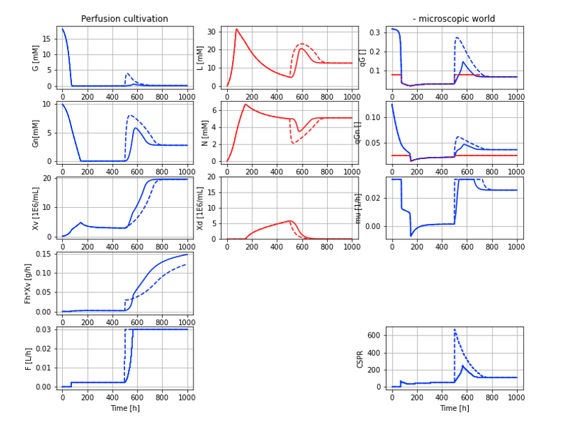

# BPL_CHO_Perfusion

This example of cultivation of CHO culture using perfusion technique is in laboratory scale. The model describes by-product (lactate and ammonia) formation at over-feeding based on a publication. The original model is extended to describe also recombinant protein production. The model was originally developed for fedbatch cultivation but is here used for understanding of perfusion cultivation. Here is no direct experimental support for the simulations, so far. The simulations gives results that is in a qualitiative way what to expect from experiments. The model also bring a better understanding fo the concept of CSPR (Cell Specifict Perusion Rate) that is often used in the industry. Simulations are done using an FMU from Bioprocess Libraray *for* Modelica. Below a typical simulation you will see in the Jupyter notebook.

You start up the notebook in Colab by pressing here
[start BPL notebook](https://colab.research.google.com/github/janpeter19/BPL_CHO_Perfusion/blob/main/BPL_CHO_Perfusion_colab.ipynb)
or alternatively using FMPy
[start BPL notebook](https://colab.research.google.com/github/janpeter19/BPL_CHO_Perfusion/blob/main/Notes_BPL_CHO_Perfusion_cspr_openloop_fmpy_colab.ipynb)

Then you in the menu choose Runtime/Run all. The installation takes just a few minutes. The subsequent execution of the simulations of microbial growth take just a second or so. 

You can continue in the notebook and make new simulations and follow the examples given. Here are many things to explore!

Note that:
* The script occassionaly get stuck during installation. Then just close the notebook and start from scratch.
* Runtime warnings are at the moment silenced. The main reason is that we run with an older combination of PyFMI and Python that bring depracation warnings of little interest. 
* Remember, you need to have a google-account!

Just to be clear, no installation is done at your local computer.

Work in progress - stay tuned!

License information:
* The binary-file with extension FMU is shared under the permissive MIT-license
* The other files are shared under the GPL 3.0 license

